# Staff Pulse

Дашборд мониторинга орг-структуры компании: дивизионы, отделы и команды. Интерактивное дерево, аналитическая таблица с агрегатами по поддереву, live-обновления по WebSocket и поиск на естественном языке.

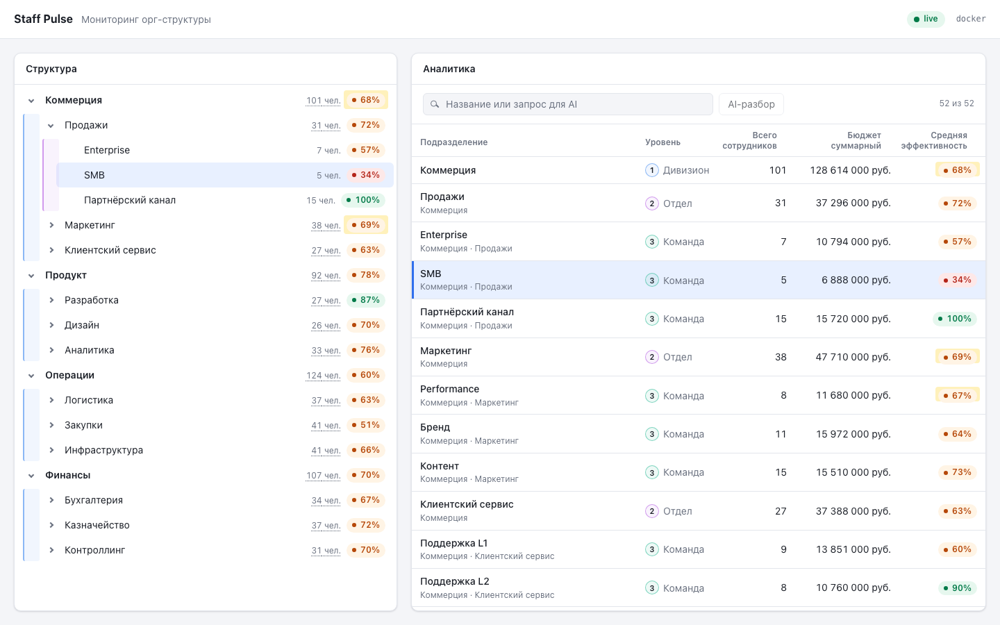

Тестовое задание выполнено по этапам ТЗ; каждый этап — отдельный коммит с тегом `step/N`.

| Этап | Тег | Что внутри |
|---|---|---|
| 01 Foundation | `step/1` | каркас, mock API, валидация и кэш, дерево, состояния загрузки |
| 02 Core | `step/2` | аналитическая таблица: агрегаты, сортировка, фильтр, связь с деревом |
| 03 Polish | `step/3` | WebSocket-патчи, индикатор соединения, клавиатура, анимации |
| 04 Bonus | `step/4` | Docker и nginx, прод-сборка, AI-поиск с fallback |

## Запуск

### Docker, одной командой

```bash
cp .env.example .env    # необязательно: порт, частота патчей, ключ OpenAI
docker-compose up --build
```

Дашборд: http://localhost:8080 (порт задаёт `CLIENT_PORT`). nginx раздаёт статику с gzip и проксирует `/api` и `/ws` на mock-сервер. Без `OPENAI_API_KEY` всё работает, AI-поиск переключается на обычный поиск по названию.

### Локально

```bash
pnpm install
pnpm dev
```

Клиент: http://localhost:5173, mock API: http://localhost:3001. Требуется Node ≥ 24 (сервер исполняет TypeScript напрямую, без транспиляции).

Переменные окружения описаны в `.env.example`; файл `.env` необязателен, локальный сервер подхватывает его через `node --env-file-if-exists`.

Скрипты: `dev` (клиент + сервер), `build`, `start` (превью прод-сборки), `typecheck`, `test`, `lint`, `lint:fix`.

### Состояния клиента

Mock-сервер воспроизводит состояния через переменную окружения:

```bash
MOCK_SCENARIO=empty pnpm dev:server    # пустой ответ
MOCK_SCENARIO=error pnpm dev:server    # 500
MOCK_SCENARIO=slow pnpm dev:server     # задержка 2 с (skeleton)
MOCK_SCENARIO=invalid pnpm dev:server  # ответ, не проходящий схему
```

### Live-обновления

Сервер меняет случайные узлы в среднем раз в 2 с (раз в пять тиков — пачку из 2–4 узлов) и рассылает патчи по WebSocket `/ws`. Частота задаётся переменной окружения:

```bash
PATCH_INTERVAL_MS=500 pnpm dev   # патчи чаще, удобно смотреть подсветку
```

Индикатор соединения в шапке: «подключение», «live», «переподключение через N с», «офлайн». Чтобы увидеть переподключение, остановите сервер: попытки идут с растущей задержкой до 30 с, после запуска сервера индикатор вернётся в «live».

Клавиатура в таблице: Tab переводит фокус в таблицу (одна остановка), ↑/↓ — соседняя строка, Home/End — первая и последняя, Enter выбирает узел в дереве.

Клавиатура в дереве: одна tab-остановка, ↑/↓ — соседний видимый узел, → раскрывает ветку или входит в неё, ← сворачивает или поднимается к родителю, Home/End — первый и последний видимый узел, Enter или Space выделяет узел.

### AI-поиск

Поле поиска в таблице фильтрует по названию в реальном времени. Enter или кнопка «AI-разбор» отправляют тот же текст модели, и она возвращает структурированный фильтр: уровни, диапазоны численности, бюджета и эффективности, сортировку. Распознанные условия показываются чипами, каждое можно убрать.

```bash
OPENAI_API_KEY=... pnpm dev   # или строкой в .env; модель меняет OPENAI_MODEL
```

Примеры запросов: «команды с эффективностью ниже 50», «отделы, где больше 30 сотрудников», «топ дивизионов по численности», «бюджет меньше 5 млн». Без ключа, при ошибке или таймауте 5 с появляется бейдж «AI недоступен», а введённый текст продолжает работать как фильтр по названию. Если модель не нашла в запросе условий (например, «какая погода завтра»), поле сообщает об этом, а текст остаётся обычным фильтром.

## Скриншоты

Сняты на прод-сборке (Docker и `vite preview`).

| | |
|---|---|
| 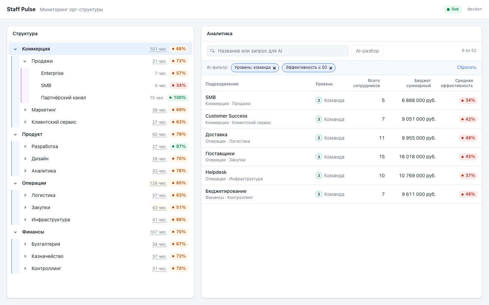 | 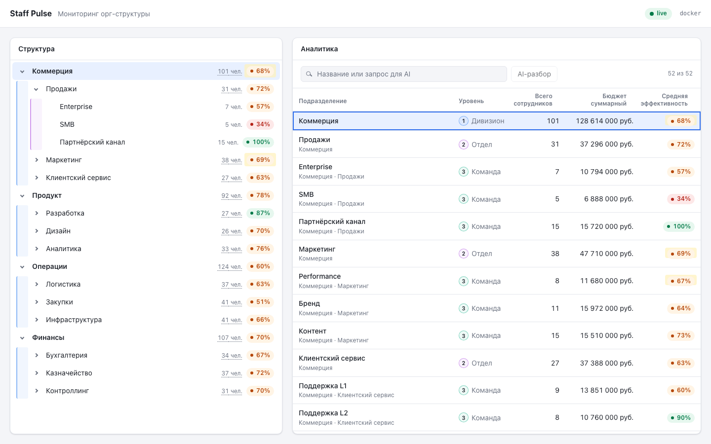 |
| AI-поиск: «команды с эффективностью ниже 50» | Подсветка изменённых ячеек после патча |
| 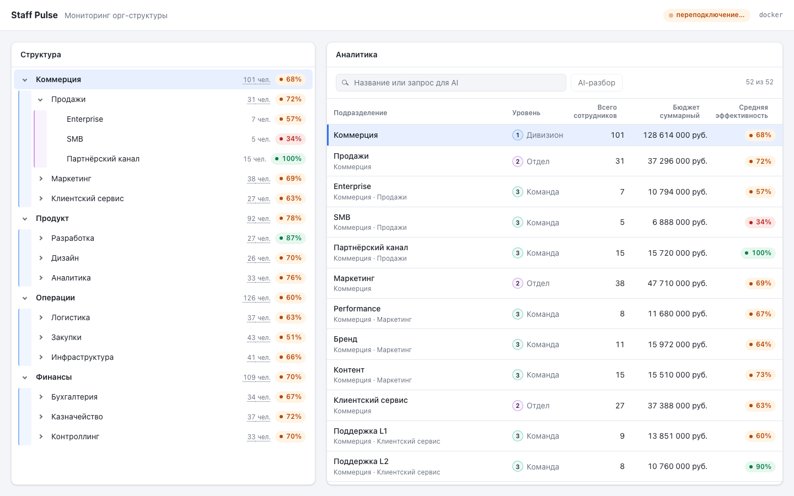 | 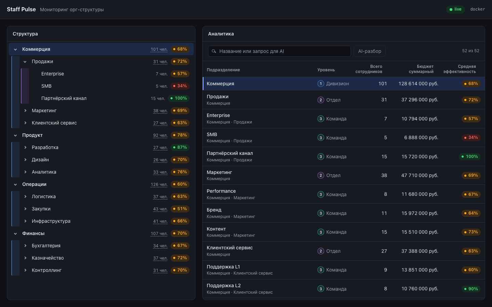 |
| Сервер остановлен: переподключение | Тёмная тема по настройке системы |
| 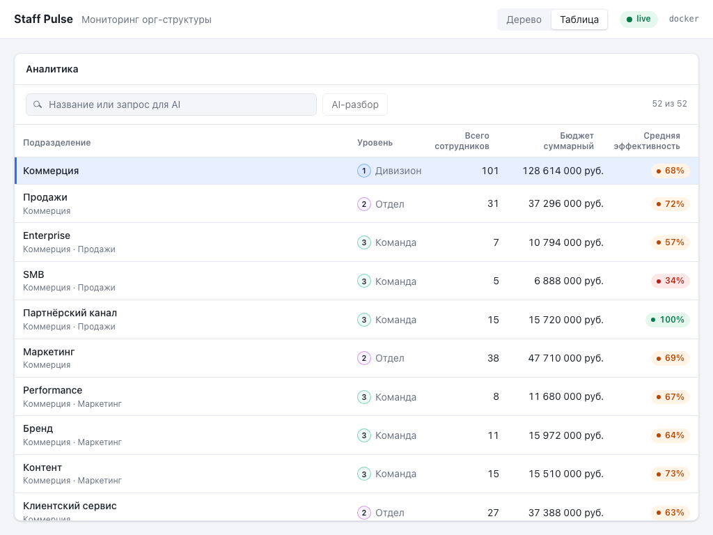 | 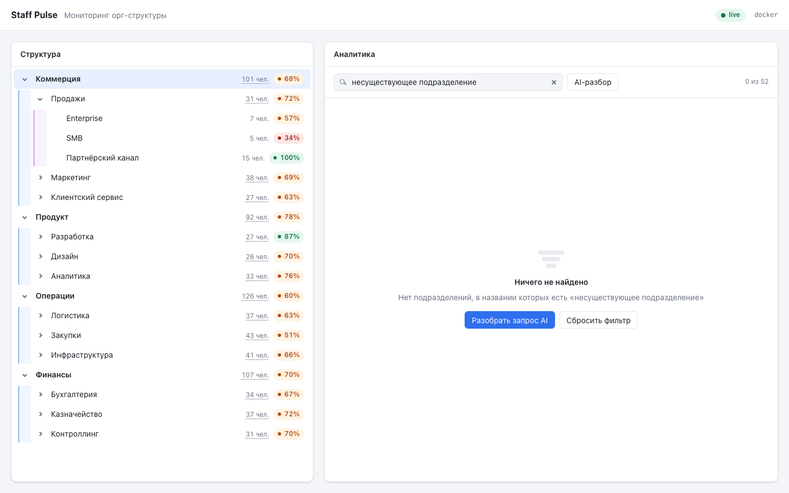 |
| Ширина 1024px: переключатель представлений | Ничего не найдено: сброс и AI-разбор |
| 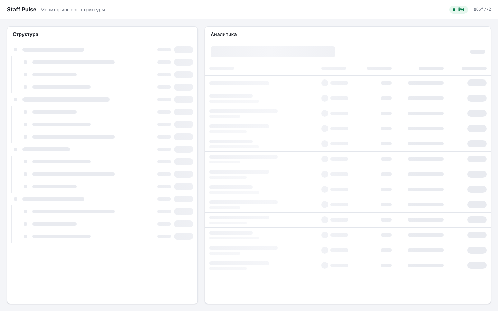 | 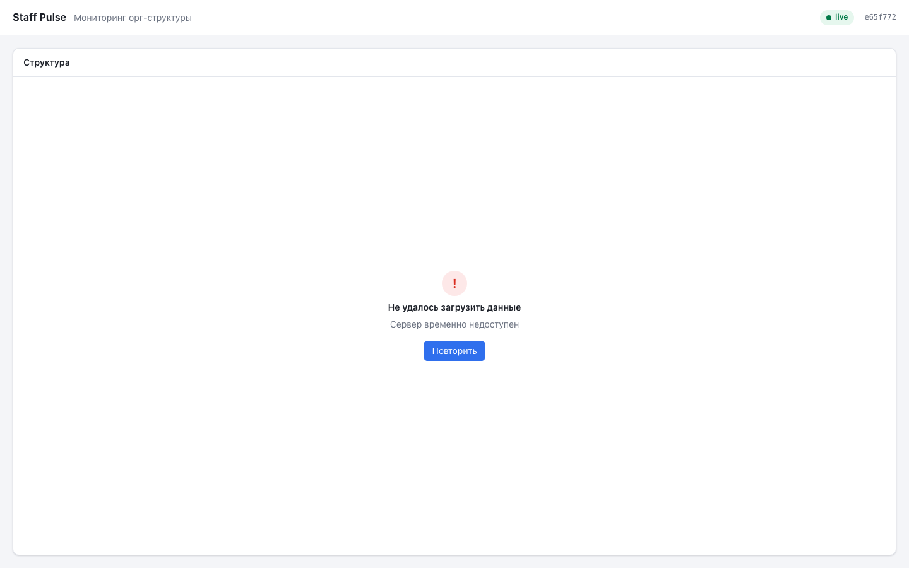 |
| Загрузка: скелетоны по форме контента | Ошибка сервера с повтором |
| 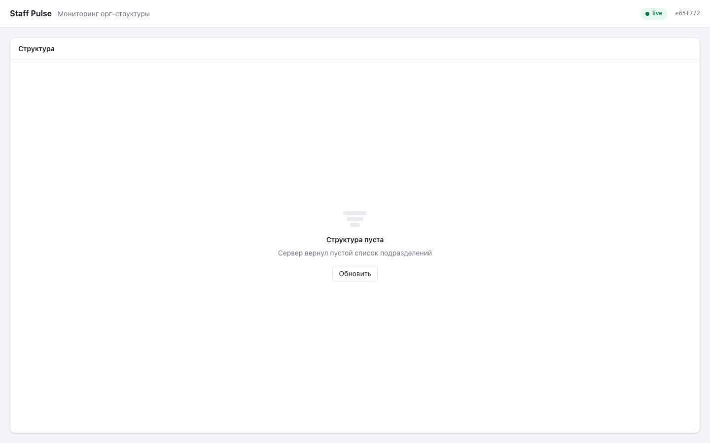 | 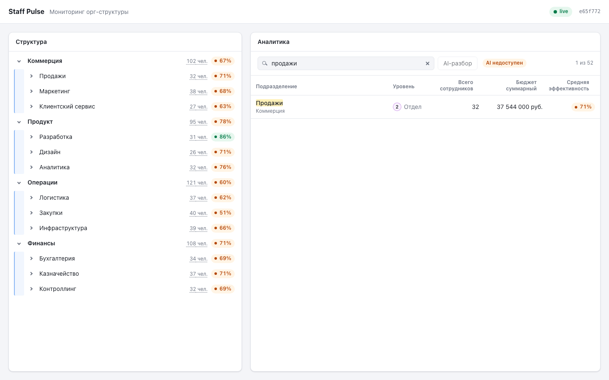 |
| Сервер вернул пустую структуру | Без ключа: текстовый поиск и бейдж |

## Стек

React 19, Vite 8, TypeScript (strict), styled-components 6, TanStack Query 5, zod 4, Biome, Vitest. Mock-сервер — `node:http` и `ws`, AI-поиск — OpenAI Responses API. Прод — nginx и Docker Compose.

## Структура репозитория

```
src/                клиент: api/ components/ hooks/ providers/ pages/ utils/ types/ constants/ styles/
server/             mock API, WebSocket-тикер, разбор AI-поиска (Node 24, .ts без сборки)
shared/             контракт клиента и сервера: zod-схемы, пути API
docs/               architecture.md, data-model.md, adr/, media/
openspec/           спецификации и планы по этапам (spec-driven workflow)
.claude/            скиллы проекта для Claude Code
Dockerfile.client   сборка клиента и nginx со статикой
Dockerfile.server   mock-сервер с prod-зависимостями
nginx.conf          gzip, SPA-fallback, прокси /api и /ws
docker-compose.yaml клиент и сервер одной командой
```

## Размер прод-сборки

`pnpm build`: JavaScript — 130.4 КБ gzip, отдельного CSS нет (стили в styled-components). Nginx отдаёт бандл с `gzip_comp_level 6`, по сети уходит около 129 КБ.

## Интерпретации ТЗ

Места, где ТЗ допускает несколько прочтений, и выбранный вариант:

- **«Второй уровень открыт по умолчанию»** — раскрыты корневые узлы: видны дивизионы и их отделы, команды свёрнуты. Глубина задаётся константой `DEFAULT_EXPANDED_DEPTH`.
- **`headcount` и `performance` в узле дерева** — суммарная численность поддерева и средняя эффективность, взвешенная по численности: иерархию читают сверху вниз как суммы. Собственные значения узла — в подсказке при наведении.
- **Слой кэширования** — TanStack Query, а не собственный кэш: ТЗ допускает «аналог», см. [ADR-001](docs/adr/001-tanstack-query-cache.md).
- **Сортировка кликом и двойным кликом.** Браузер присылает `dblclick` только после двух `click`, поэтому клик по активному столбцу ничего не меняет, клик по другому столбцу включает его по возрастанию, двойной клик обращает направление ровно один раз. Стартовое направление одинаковое для всех столбцов, поэтому двойной клик по неактивному столбцу всегда даёт убывание.
- **Сортировка с клавиатуры.** Двойной клик с клавиатуры недоступен, поэтому Enter или Space на заголовке активного столбца обращает направление, на неактивном — включает его по возрастанию.
- **Порядок таблицы по умолчанию** — порядок дерева (дивизион, его отделы, их команды), ни один столбец не активен. При равных значениях любая сортировка сохраняет порядок дерева.
- **Фильтр не влияет на агрегаты.** Он только скрывает строки, суммы по-прежнему считаются по всему поддереву. Ищется только название, не путь родителей. Ввод применяется с дебаунсом 250 мс, очистка — сразу.
- **«Уровень»** — глубина узла в данных (1, 2, 3…) с подписью «Дивизион / Отдел / Команда», а не разбор названий. Глубже третьего уровня подпись — «Подразделение».
- **«—» в средней эффективности** — у поддерева нулевая суммарная численность, взвешенное среднее не определено. Такие строки всегда в конце сортировки.
- **Split-view** — от 1280px дерево и таблица показаны рядом, уже — переключатель «Дерево / Таблица» в шапке. Выделение и раскрытые узлы общие для обоих представлений.
- **Патч меняет только численность, бюджет и эффективность узла.** Название и `parentId` в патче не приходят, поэтому структура дерева живыми обновлениями не меняется, а пересчитывается одна цепочка предков.
- **Рефетч после переподключения** выполняется, только если версия данных на сервере отличается от версии на клиенте: так и пропущенные патчи, и перезапуск сервера закрываются одним запросом, а короткий обрыв без изменений не стоит ничего.
- **Подсветка** появляется только у ячеек, значение которых изменилось. При первой загрузке, раскрытии ветки или появлении строки после фильтра ячейки не подсвечиваются. При `prefers-reduced-motion` подсветка держится 1.5 с без плавного затухания.
- **Ошибка фонового обновления** не убирает данные с экрана: показываются последние загруженные, в шапке — «не удалось обновить».
- **AI-разбор запускается по Enter или кнопке, а не на каждое нажатие.** Каждый разбор — платный запрос к модели длительностью 1.5–2.5 с; фильтр по названию при этом по-прежнему работает в реальном времени на том же поле. После успешного разбора поле очищается, условия переезжают в чипы.
- **Провайдер AI-поиска — OpenAI.** ТЗ провайдера не задаёт; вызов модели изолирован в `server/search.ts`. Модель по умолчанию `gpt-5.6-terra` выбрана замером, см. [ADR-005](docs/adr/005-ai-search-with-fallback.md).
- **Границы диапазонов в AI-фильтре включительны.** «Ниже 50» модель возвращает как верхнюю границу чуть меньше 50, чип показывает «≤ 50». AI-фильтр применяется поверх фильтра по названию и, как и он, не влияет на агрегаты.
- **Без ключа AI-поиск не выключается целиком:** бейдж «AI недоступен» появляется при первом разборе, введённый текст остаётся фильтром по названию, кнопка разбора до перезагрузки страницы неактивна.


## Документация

- [Архитектура](docs/architecture.md) — слои приложения, поток данных от API до UI, live-обновления, AI-поиск, развёртывание.
- [Модель данных](docs/data-model.md) — дерево, алгоритм агрегации, строки таблицы, контракты WebSocket-патча и AI-поиска.
- ADR: [001 — TanStack Query как кэш](docs/adr/001-tanstack-query-cache.md), [002 — агрегаты в кэше](docs/adr/002-aggregates-in-cache.md), [003 — WebSocket и сверка по версии](docs/adr/003-websocket-live-updates.md), [004 — анимация высоты через grid](docs/adr/004-height-animation-grid.md), [005 — AI-поиск с fallback](docs/adr/005-ai-search-with-fallback.md).

## Проверка качества

- `pnpm typecheck && pnpm lint && pnpm test && pnpm build`; то же запускает pre-commit хук.
- 93 unit-теста на чистые функции и контракты: агрегация, `applyPatch` (1000 случайных патчей против полной пересборки), сверка версий патчей, backoff, сортировка и клик/двойной клик, фильтры, AI-фильтр, чипы и схема AI-запроса, клавиатурная навигация по таблице и дереву, форматирование.
- `graphify update .` строит граф кода (циклов импортов нет), `npx jscpd@4 src server shared` ищет дубли (повторы остались только в тестовых фикстурах).

## AI в разработке

Проект сделан в паре с AI: код, тесты, конфигурация и документация сгенерированы, автор ставил задачи, проверял каждый этап в браузере, принимал решения и возвращал замечания. Работа с AI фиксировалась по ходу в журнале; ниже выжимка из него.

### Инструменты

- **Claude Code.** Claude Fable 5.1 — планирование, этап 01 и приёмочные ревью; Claude Opus 5 — реализация этапов 02–04.
- **OpenSpec.** Четыре change по этапам ТЗ (proposal, specs, design, tasks), каждый архивировался перед коммитом этапа; итоговые спецификации в `openspec/specs`.
- **Контекст для AI.** `CLAUDE.md` и скиллы проекта: `code-style` (конвенции), `assignment-tradeoffs` (интерпретации ТЗ и решения, чтобы не перерешивать их), `stage-review` (чеклист приёмки этапа).
- **Документация вместо памяти модели.** Context7 и официальные страницы: версии библиотек, отмена запросов в TanStack Query, `resolve.tsconfigPaths` в Vite 8, OpenAI Responses API и цены моделей.
- **Контроль роста.** graphify (граф кода, связи и циклы) и jscpd (дубли) — часть приёмки каждого этапа.
- **Проверки без ручного клика.** Node-скрипты против живого сервера (WebSocket, сквозная проверка «реальные патчи → модель совпадает со снапшотом»), серверный рендер компонентов, headless Chrome через DevTools Protocol: более 40 пользовательских сценариев и скриншоты для README. Временные скрипты в репозиторий не входят.

### Что сгенерировал AI

- План: OpenSpec-артефакты всех этапов, скиллы проекта, `CLAUDE.md`.
- Код всех слоёв: mock-сервер (данные с сидом, `ETag`, сценарии, WebSocket-тикер, разбор AI-поиска), общий контракт на zod, слой данных на TanStack Query, модель и агрегация, `applyPatch`, хуки, провайдер выделения, компоненты, тема, Docker и nginx.
- Тесты на чистые функции и документацию: README, архитектура, модель данных, ADR.

### Что изменено по решению автора и почему

Автор не правил код руками — все изменения внесены AI по его решениям после проверки:

- **Числа в дереве.** Собственная численность на родителе («дивизион — 5 чел.» над командой из 15) читалась как ошибка → дерево показывает суммы по поддереву, агрегация перенесена на первый этап.
- **Глубина дерева терялась визуально** → цветные направляющие вложенности; подсказка с собственными значениями стала мгновенной, называет уровень («В самом отделе») и округляет эффективность.
- **Сортировка путала:** текстовые столбцы стартовали по возрастанию, числовые — по убыванию → единое правило для всех столбцов.
- **Таблица вылезала за панель** ниже 1330px → исправлено в корне (`min-width: 0` у grid- и flex-контейнеров), правило добавлено в скилл.
- **Загрузка и состояния:** скелетоны по форме реального контента, сообщения об ошибке и пустом ответе по центру панели.
- **Провайдер AI-поиска:** план был на Anthropic, у автора оплаченный доступ к OpenAI → OpenAI, модель выбрана замером.
- **Процесс:** коммиты делает только автор, по одному на этап; комментарии в коде только на английском; graphify и jscpd добавлены, чтобы следить за связями и дублями.

### Что AI переделал сам после проверок

- **Подсветка изменённых ячеек.** План включал анимацию по версии снапшота — в момент первого патча мигнули бы все ячейки. Реализовано сравнение значения в самой ячейке.
- **Рефетч после переподключения только при расхождении версий** — это закрыло и пропущенные патчи, и перезапуск сервера, у которого версия начинается заново.
- **Общий `tsconfig.base.json` и `resolve.tsconfigPaths`:** graphify не видел алиасы `src/*` и терял около 200 связей, заодно ушли дубли настроек в трёх tsconfig.
- **Дубли кода:** общий `randomInt`, компонент `StateMessage` для пустых и ошибочных состояний, миксин для шапок панели.
- **Найдено в браузере на этапе 04:** ответы демо-сценариев делили `ETag` с реальными данными, и браузер показывал закэшированный пустой ответ; колонки таблицы прыгали при фильтрации; бейдж писал «переподключение через 0 с».
- **AI-разбор по Enter, а не на каждое нажатие** — из-за стоимости и задержки ответа модели.

### Где AI ошибался

- Разные стартовые направления сортировки — решение AI из плана, отменено автором.
- Пропущенный `min-width: 0` в раскладке — баг нашёл автор.
- Стрелки в дереве не работали после клика мышью в Safari и Firefox: эти браузеры на macOS не ставят фокус на нажатую кнопку. AI проверял только в Chrome, баг нашёл автор; узел теперь берёт фокус сам на `mousedown`.
- Коллизия `ETag` в mock-сервере — заложена AI на этапе 03, найдена им же сквозной проверкой в браузере.
